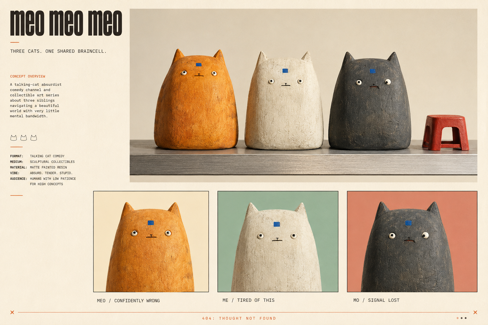

# One Meo Meo Meo universe

Integrated 6 September 2026 against `main` at `25ea699ceae491f5bad72d2c1c60b897c3e2cfe3`.

The Roblox MOBA is the playable world. The talking-cat channel follows its inhabitants. The proposed Robinhood Chain asset shares that identity. This supersedes the earlier assumption that we were starting with only a comedy channel and choosing a game later.

**Channel:** Three cats. One shared braincell.

**Game:** Three lanes. One shared braincell.

**Running joke:** 404: thought not found.

## What is already real in the repo

- Fourteen champions, three lanes, towers, gated nexuses, server-owned combat, items and progression.
- Solo practice against three bots; underfilled queues are filled toward three per side, while maximum team size is five.
- Pawmart clerks, Old Tom and Kitty Caster, with authored mock replies and an optional HTTP provider.
- Voice integration with fallbacks; it does not supply NPC spoken audio by itself.
- Simulated champion tickers and yarn, independent of blockchain prices.
- Custom hybrid Meo404 Solidity code and a stub claim bridge. Neither is evidence of a live chain deployment, liquid market, equity entitlement or Roblox approval.

## The trio belongs beside the champions

MEO, ME and MO are recurring hosts, spectators and comic protagonists. They do not replace the 14 champions, become extra draft slots, or confer paid combat advantages.

| Host | Personality | Game relationship | First story |
|---|---|---|---|
| MEO, orange | Confidently wrong | Declares strategies with Chairman Meow; gets corrected by Professor Whiskers | Treats a closed door like a denied gank |
| ME, ivory | Practical, tired of this | Keeps the shop and controls understandable; relates to Grandma Fluff | Explains F recall versus B shop |
| MO, charcoal | Signal lost | Misunderstands Bytekit literally; gives solemn explanations for cat behavior | “We requested options” at champion select |

`src/shared/BrandCatalog.luau` is the runtime source for the trio's identities, colors, taglines and mock lines. `NpcCatalog` registers the hosts, `MockAiProvider` uses their authored lines, and `MapBuilder` places three non-colliding prototype figures by the lobby. The existing NPC chat prompt opens the conversation. Existing shopkeepers, coach and announcer retain their roles.

Keep each speaker recognizable by sentence rhythm. MEO makes a concrete claim. ME exposes a practical contradiction. MO concludes with absurd logic. The joke targets the cats, not the player's ability. Instructions about controls, cooldowns and objectives must remain correct.

## Translate the approved look into a MOBA

The approved reference uses matte sculptural surfaces, restrained palettes, wide-set eyes, tiny mouths and a cobalt square on the hosts' foreheads. The generated character sheet is a model reference, not a mesh, rig or texture atlas. The runtime hosts are simple geometric stand-ins.

Use this art language for lobby scenes, portraits, channel close-ups and collectible illustrations. During combat, prioritize team colors, role silhouettes, facing direction and ability telegraphs. The forehead square identifies the trio; do not put the same bright square on every champion and erase distinctions.

Preserve the existing roster's identities:

| Existing champion | Proposed visual translation |
|---|---|
| Chairman Meow | Broad composed silhouette; one distinctive executive motif |
| Nyan Rocket | Lean, forward silhouette with a readable motion trail |
| Chonk Knight | Largest rounded loaf; a compact armor treatment |
| Professor Whiskers | Precise pose and immediately readable laser-pointer cue |
| Scammy McMittens | Fast-talking trickster with a conspicuous paper prop; game fiction stays separate from real financial promotion |
| Grandma Fluff | Soft silhouette and a warm protective casting pose |
| Bytekit | Squared machine panels and a compact signal indicator |
| Chromeclaw | Organic body with one distinct mechanical claw |
| Oracle Paws | Calm silhouette with a support-oriented halo shape |
| Archmeow | Tall, clear wizard silhouette |
| Hexkit | Uneven magical motif and concentrated spell color |
| Sir Scratchalot | Upright martial posture and readable armor edges |
| Shadowpounce | Low narrow silhouette and a strong pounce direction |
| Mindwhisker | Suspended small objects suggesting telekinesis |

These are art briefs, not new abilities or balance changes. Current champion colors and Q/W/E/R data remain the gameplay authority.

Palette for marketing and portraits: ivory `#F3EFE5`, charcoal `#252725`, orange `#E88845`, celadon `#B7C9BB`, salmon `#D9A69B`, cobalt `#3154D5`. Keep the current HUD's Blue/Red team semantics. Do not recolor combat UI merely to match an editorial board.

## Episodes now introduce the game world

Keep the household Options short as the entry point; its last line becomes a callback in the lobby. Follow with clips that reveal one real game mechanic each, without turning every clip into a tutorial or sales message.

| Episode | Dialogue beat | Gameplay anchor |
|---|---|---|
| Options | Door opens. Nobody moves. MO: “We requested options.” | Trio introduction; reuse at draft |
| Remote work | MEO: “I'm working remotely.” ME: “You're at the fountain.” MO: “Remote from consequences.” | Fountain regen; F recall |
| Open plan | MEO: “Open the nexus.” ME: “Three towers first.” MO: “It has references.” | Actual three-tower gating |
| Peer reviewed | MEO places a ward. ME: “What did you see?” MO: “My previous mistake.” | Trinket on 4 |
| Management | MEO: “I bought boots.” ME: “Are you rotating?” MO: “He promoted his feet.” | Pawmart and map movement |
| Signal lost | Bytekit enters. MEO: “He has the braincell.” ME: “That's a battery.” MO: “Finally. A sustainable thought.” | Champion cameo, no invented ability |

Production rule: 12–20 seconds is a starting hypothesis, not a platform requirement. One setup, one contradiction, one payoff. Use original audio; publish reusable reactions. Measure watch percentage, shares and follows relative to comparable clips on the same platform. Use actual captured game footage when advertising gameplay; label concept renders and animatics accurately.

## Collectible direction

Study 24 portraits: three hosts × eight emotional states. Publish neither supply nor rarity percentages until the final selection is settled. Tie artwork to recognizable episode moments, then expand toward champion art after visual development. A collector should want the image without needing to see a rarity label.

For the current hybrid contract, a persistent token ID is not guaranteed through fungible transfers: sender NFTs can burn and recipient NFTs can be created with new IDs. A self-transfer can also recycle IDs in the current implementation. Therefore, do not promise that holding/trading the fungible asset preserves a specific rare portrait. The contract also uses growing IDs rather than a fixed 24-ID art universe. Resolve metadata assignment, supply, exemptions, and rare-art preservation before selecting production economics.

The art may share characters with Roblox. Ownership does not automatically unlock a champion, improve a statistic, create voting/shareholder rights, or grant commercial art rights. Any actual license must be specified separately. See [Robinhood pairing](../robinhood-chain-pairing.md) for the verified and unresolved parts of that proposal.

## Included creative assets

- [Approved art direction](assets/art-direction.png)
- [Character study](assets/character-study.png)
- [Options storyboard](assets/options-storyboard.png)
- [15-second Options animatic](assets/options-animatic-v1.mp4)
- [Art prompt](assets/art-generation-prompt.txt) and [character/storyboard prompts](assets/production-image-prompts.txt)

Images were generated with the built-in imagegen tool. The animatic edits static storyboard frames with temporary system voices, captions and synthetic timing sounds. It is not finished animation or Roblox footage. Fix doubled door hardware and inconsistent door state when producing the final scene; use a shared first/last frame for a clean loop. Assets in this folder are references and are not uploaded Roblox asset IDs.

## Validation and next production steps

`python3 tools/test-brand.py /path/to/luau` syntax-compiles `src` when a sibling `luau-compile` is available and runs host/NPC/roster/UI smoke checks with a small engine stub. This validates logic, not Roblox rendering, networking, text filtering, or HTTP-provider behavior.

Studio checklist: verify three hosts at the lobby, read each Talk prompt, confirm the authored voices differ, ensure all 14 draft entries remain, start practice, verify hosts do not obstruct movement, and complete the existing nexus loop. Check phone and desktop UI layouts. This pass has not been playtested in Roblox Studio.

Next: replace host primitives with approved meshes; capture a real match for visual alignment; make a champion model sheet; record the Options cast; decide the exact external financial product before implementing its integration. Existing NPC/HTTP text moderation and receipt persistence are separate production work, not solved by this concept merge.
